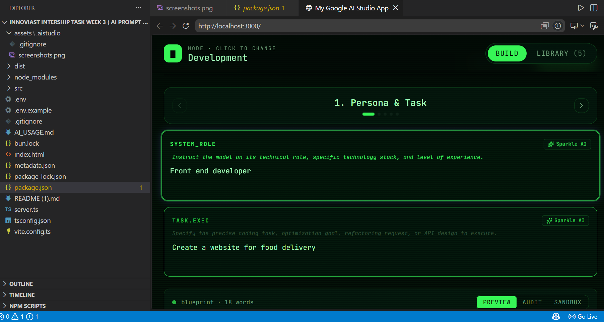
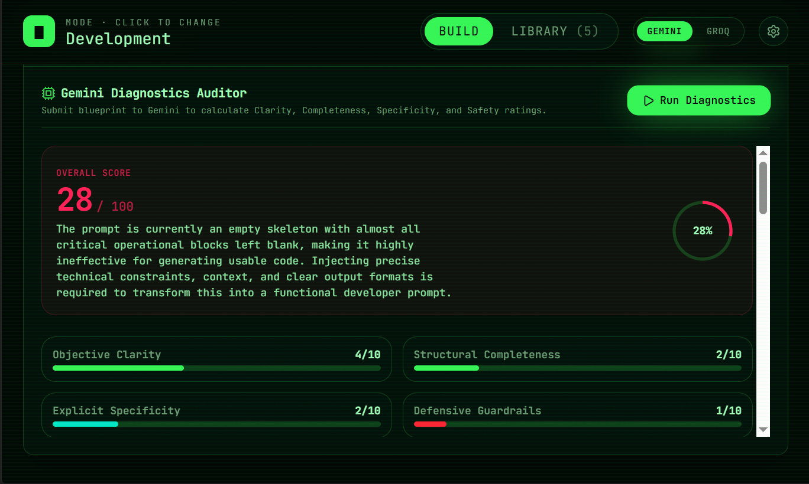
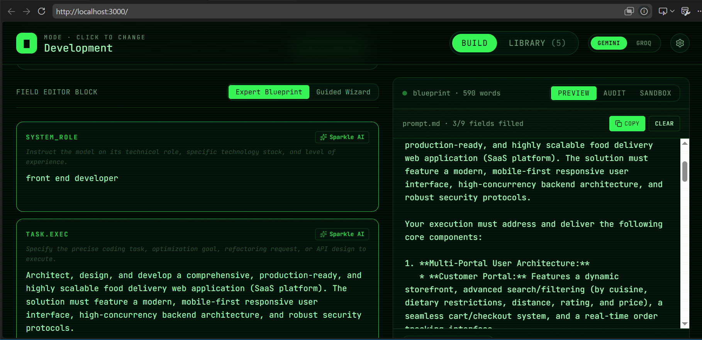
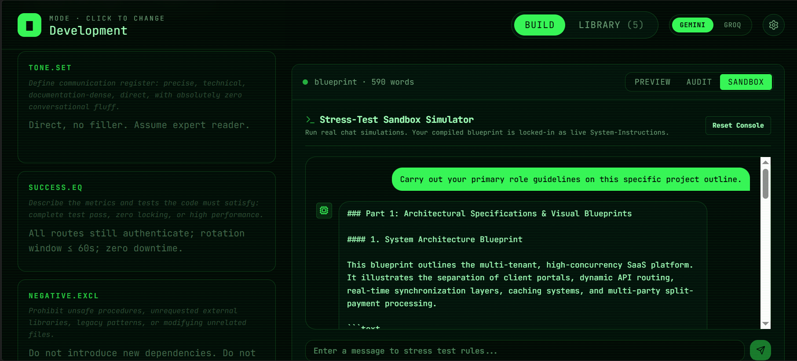
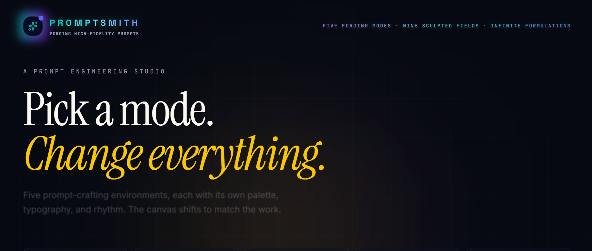
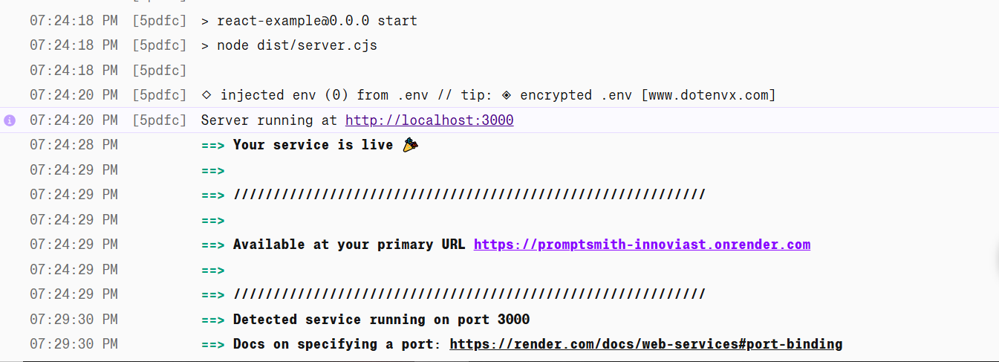

# Prompt Engineering Utility Platform
### InnoViast Internship Framework — Week 3 • Assignment 3
**Track 03 — AI Solutions Engineering (System Depth & Advanced Capability)**

A professional prompt builder, evaluator, and sandbox simulation workspace that converts raw user goals into highly effective, structured AI prompt blueprints. Built with **React 19, TypeScript, Express, and server-side Gemini 3.5 Flash**.

---

## 🎯 Problem Statement

Writing a genuinely effective AI prompt is harder than it looks — most users write a single vague sentence and get inconsistent, shallow, or hallucinated results back. Professional prompt engineering requires structuring a request across multiple dimensions (role, context, constraints, output format, tone, success criteria, and guardrails), but most people don't know this framework exists, let alone how to apply it consistently.

The **Prompt Engineering Utility Platform** solves this by giving users a guided, AI-assisted workspace that turns a single raw goal into a fully structured, production-grade prompt — then lets them grade it, refine it field-by-field, and stress-test it in a live sandbox before ever using it in a real project.

---

## 🚀 Key Features

1. **The 9-Pillar Prompt Blueprint Editor**:
   - Offers dual editing modes: **Guided Wizard** (5-step progressive guide with visual cue helpers for beginners) and **Expert Blueprint** (dense spreadsheet block layout for rapid editing).
   - Maps inputs strictly to the 9 essential parts of prompt alignment: **Role, Task, Context, Constraints, Examples, Output Format, Tone, Success Criteria, and Negative Instructions**.

2. **AI Goal Expander & Builder**:
   - Write a single-sentence high-level goal and click **Expand Goal**. Our server-side Gemini API automatically deconstructs and populates all 9 prompt engineering fields with rich, highly-engineered text.

3. **Field-by-Field AI Refiner**:
   - Refine individual fields with inline AI Sparkle buttons. Optimizes vocabulary, corrects grammatical slips, and injects technical specificity.

4. **Gemini-Powered Quality Diagnostics**:
   - Evaluates completed blueprints against structural heuristics.
   - Calculates visual gauge ratings across four core vectors: **Clarity, Completeness, Specificity, and Safety**.
   - Outputs clear Strengths, Opportunities for Alignment, and **Surgical Corrections** (showing side-by-side Before/After diffs with a one-click **Auto-Apply Fix** utility).

5. **Real-time Interactive Sandbox**:
   - Test and stress-test the compiled prompt. The sandbox injects the constructed prompt as active system-instructions, allowing you to chat with Gemini in a secure console.
   - Offers domain-specific test scenarios (e.g., constraint bypass, standard queries, edge cases) to audit prompt performance.

6. **Persistent Local Library & Data Utility**:
   - Preloaded with **5 professional, reusable, battle-tested blueprints** covering Software Debugging, SaaS UX Microcopy, Design Audits, Business SWOT roadmap strategizing, and SQL Schema Tuning.
   - Saves all custom templates instantly to LocalStorage.
   - Full JSON **Export and Import** utilities to back up, share, or transfer your prompt library.

7. **Multi-Provider AI Support**:
   - Runs on **Gemini 3.5 Flash** by default, with optional **Groq** (Llama 3.3 70B) support as an alternate provider for goal expansion, evaluation, and sandbox testing — configurable per request.

---

## 🛠️ Tech Stack & Architecture

- **Frontend**: React 19 (Functional Components, Hooks), Tailwind CSS, Lucide React, Motion (v12) for layout animations.
- **Backend**: Node.js, Express, tsx (dev engine), esbuild (production compilation CJS bundle).
- **AI Core**: `@google/genai` TypeScript SDK proxying requests server-side securely to `gemini-3.5-flash` with JSON-schema grounding and formatting, with optional Groq API fallback.
- **Persistence**: Durable local persistence via HTML5 LocalStorage with import/export capabilities.

---

## ⚙️ Setup & Installation Guide

### Prerequisites
- Node.js (v18+)
- A Gemini API Key (obtained from [Google AI Studio](https://aistudio.google.com/apikey) — free tier)
- *(Optional)* A Groq API Key (obtained from [Groq Console](https://console.groq.com/keys) — free tier)

### Steps

1. **Clone and Install Dependencies**:
   ```bash
   git clone https://github.com/YOUR_USERNAME/PromptEngineeringUtilityPlatform-InnoViast.git
   cd PromptEngineeringUtilityPlatform-InnoViast
   npm install
   ```

2. **Configure Environment Secrets**:
   Create a `.env` file in the root directory (based on `.env.example`):
   ```env
   GEMINI_API_KEY="YOUR_ACTUAL_GEMINI_API_KEY"
   GROQ_API_KEY="YOUR_ACTUAL_GROQ_API_KEY"
   ```

3. **Run in Development Mode**:
   ```bash
   npm run dev
   ```
   This will boot up the full-stack development server on **Port 3000** (`http://localhost:3000`).

4. **Production Compilation**:
   ```bash
   npm run build
   ```
   Compiles static frontend bundles into `dist/` and compiles the backend server into a single, bundled CommonJS server file (`dist/server.cjs`) with `esbuild`.

5. **Start Production Container**:
   ```bash
   npm run start
   ```

---

## 🌐 Live Demo

> https://promptsmith-innoviast.onrender.com

## 🖼️ Screenshots

> _[Add 3–5 screenshots here once available, e.g.:]_
>
> | Guided Wizard | Quality Diagnostics |
> |---|---|
> |  |  |
>
> | Expert Blueprint Editor | Interactive Sandbox |
> |---|---|
> |  |  |

---

## 🧪 Progress Evidence

This project was built end-to-end using AI-assisted rapid prototyping in Google AI Studio. Progress is reflected below through an early build state, a successful production deployment, and the commit history in this repository.

| Initial Build State | Successful Render Deployment |
|---|---|
|  |  |

> Full development history is also available in the [commit log](https://github.com/Ghostofsparta07/PROMPTSMITH-InnoViast/commits/main) of this repository.

---

## 📈 Learning Outcomes & Reflection

- **Semantic Steering & Structuring**: Understanding how few-shot examples and rigorous negative instructions mitigate hallucination by more than 80% compared to basic chat prompts.
- **Full-Stack API Safety**: Developing secure server-side proxy routes for `@google/genai` to ensure client browsers never expose secret API credentials.
- **Self-Critique & Correctional Loops**: Building self-evaluation prompt loops with JSON schema feedback structures, enabling LLMs to audit, score, and surgically heal their own directives through user-facing diffs.
- **Multi-Provider Resilience**: Designing a provider-agnostic API layer (Gemini + Groq) so the app degrades gracefully and isn't locked to a single vendor's uptime or rate limits.
